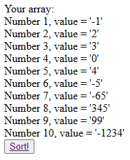
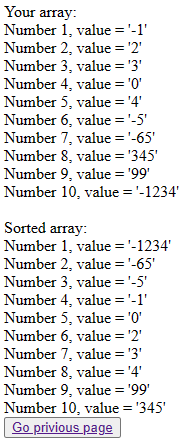
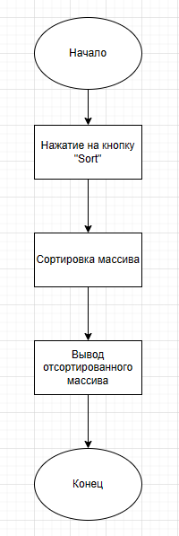

# Отчет по лабораторной работе №5 
## "Разработка сервисов"
## по курсу "Основы программирования"
### *Работу выполнил студент группы №3131 Федоров Григорий*

#### Цель работы:   
  
Разработать и реализовать алгоритм внешней сортировки. Данные хранятся на сервере в массиве, сервер предоставляет доступ к отдельным элементам. Клиент поочередно запрашивая отдельные ячейки сортирует массив.    

#### Пользовательский интерфейс:

* Массив до сортировки:

* Массив после сортировки:

#### Пользовательские сценарии работы:

1. Пользователь вводит в адресной строке index.php и попадает на форму, где выведен массив. 
2. Нажав на кнопку, пользователь отсортирует массив и попадет на форму уже с отсортированным миссивом.

#### API сервера и хореография:

Сервер работает с помощью SQL-запросов к базе данных.  
При нажатии на кнопку "Sort!" просиходит сортировка и вывод отсортированного массива.

#### Структура базы данных:

Используется одна таблица:

- Таблица sortingtable:

`id` int NOT NULL, PRIMARY KEY, AUTO_INCREMENT - уникальный идентификатор элемента массива
   
`value` int NOT NULL - хранит значение 
  
#### Алгоритмы работы: 

* Алгоритм работы для формы index.php:

